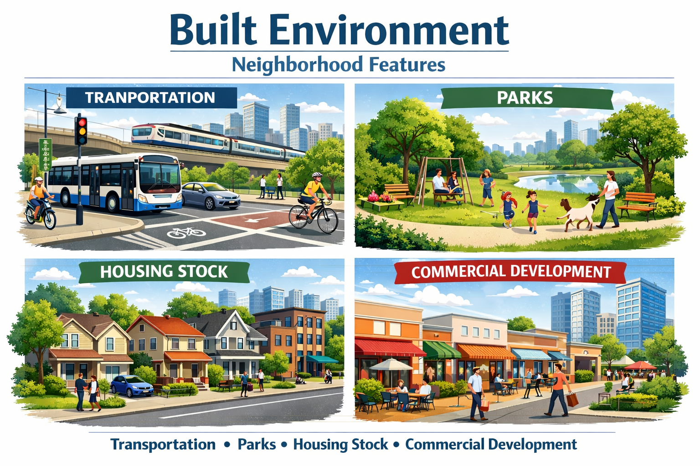

```{r}
#| include: false
# shared look for every chart in this deck; also the print-safe palette
library(ggplot2)

theme_set(theme_minimal(base_size = 17))
theme_update(
  plot.title       = element_text(face = "bold", colour = "#008080", size = rel(1.0)),
  plot.caption     = element_text(size = rel(0.62), colour = "grey35"),
  legend.position  = "top",
  panel.grid.minor = element_blank()
)

# dark vs light, not red vs green: survives a black-and-white printer
PAL <- c(low = "#7F1D1D", high = "#8FBF92")
```

```{=html}
<style>
/* --- global sizing: shrink base text and tighten vertical rhythm --- */
.reveal { --r-main-font-size: 30px; font-size: 30px; }
.reveal h1 { font-size: 1.7em; }
.reveal h2 { font-size: 1.25em; margin-bottom: 0.45em; }
.reveal h3 { font-size: 1.0em; margin-bottom: 0.3em; }
.reveal p  { line-height: 1.3; margin: 0.4em 0; }
.reveal ul, .reveal ol { margin: 0.3em 0 0.4em 0; }
.reveal li { line-height: 1.3; margin-bottom: 0.28em; }
.reveal .column p:first-child { margin-top: 0; }

.highlight-box {
  background-color: #ffffcc;
  padding: 10px 14px;
  border-left: 4px solid teal;
  margin: 8px 0;
}
.bignum {
  font-size: 230%;
  font-weight: bold;
  color: teal;
  text-align: center;
  line-height: 1.1;
  margin: 0.3em 0;
}
.takeaway {
  background-color: #e6f2f2;
  border-left: 4px solid teal;
  padding: 10px 14px;
  margin-top: 12px;
  font-size: 92%;
}
.ask {
  background-color: #fff0f5;
  border-left: 4px solid #C2185B;
  padding: 10px 14px;
  margin: 8px 0;
}
.term { color: teal; font-weight: bold; }
.tight ul { font-size: 92%; }
.reveal figcaption { font-size: 70%; }
</style>
```

------------------------------------------------------------------------

## [**Last class, in one slide**]{style="color: teal;"}

::: {.ask}
**Without looking at your notes:** what does it mean that health is a *staircase* and not a *cliff*?

Turn to your neighbour. Thirty seconds.
:::

::: {.notes}
Retrieval practice, not review. Take two answers, correct gently, move on. Target answer: health improves at every step up, so it is not just a poverty problem.
:::

------------------------------------------------------------------------

## [**Today**]{style="color: teal;"}

Advantage is distributed unevenly, and the distribution has a history.

**Today: where you actually feel it.**

::: columns
::: {.column width="25%"}
### Home
:::
::: {.column width="25%"}
### Work
:::
::: {.column width="25%"}
### Neighbourhood
:::
::: {.column width="25%"}
### Policy
:::
:::

Then: **how you would study a real community** --- and a group exercise doing it.

------------------------------------------------------------------------

# [**1. Home**]{style="color: teal;"}

------------------------------------------------------------------------

## [**Housing does three separate things**]{style="color: teal;"}

- **What it is made of** --- lead, mould, pests, cold
- **What it costs you** --- rent takes the money that would have been food or a co-pay
- **Whether you get to stay** --- three moves in a year: new school, lost doctor, no sleep

::: {.takeaway}
Only the first is about the building. The other two are **money** and **stability**.
:::

::: {.notes}
Students default to "bad housing = mould". Push them to the second and third, which do more damage and are less visible.
:::

------------------------------------------------------------------------

## [**One concrete case: lead**]{style="color: pink;"}

{fig-align="center" width="48%"}

Lead paint was legal in US homes until **1978** --- and is still in those walls.

Old housing is concentrated in poor neighbourhoods. Lead damages the developing brain, and **the damage does not reverse**.

::: {.notes}
The cleanest single illustration of the whole course: a 1978 regulation, a 2026 child, and a mechanism you can draw on the board.
:::

------------------------------------------------------------------------

## [**And the cost side**]{style="color: teal;"}

::: {.highlight-box}
Paying more than **30%** of income on rent = **cost-burdened**. Above 50% = **severely** cost-burdened.
:::

::: {.ask}
**Quick one:** rent goes up $200 a month, income doesn't. What comes out of the budget first?

Name three things. Which of them are health?
:::

::: {.notes}
Expected: groceries, prescriptions, the dentist, the car repair that gets you to work, heating. All of them are health. This makes housing cost a health variable, not a finance variable.
:::

------------------------------------------------------------------------

# [**2. Work**]{style="color: teal;"}

------------------------------------------------------------------------

## [**The wrong question and the right one**]{style="color: teal;"}

::: {.highlight-box}
Wrong question: **do you have a job?**

Right question: **what does the job do to you?**
:::

Two people both "employed" can have completely different health prospects.

------------------------------------------------------------------------

## [**Three ways a job reaches your body**]{style="color: teal;"}

::: columns
::: {.column width="33%"}
**The body takes it**

<span style="font-size:0.78em">Lifting, repetition, chemicals, heat</span>

{width="62%"}
:::

::: {.column width="33%"}
**The mind takes it**

<span style="font-size:0.78em">High demand, low control, unpredictable hours</span>

{width="62%"}
:::

::: {.column width="33%"}
**It follows you home**

<span style="font-size:0.78em">Pesticides, solvents, dust on your clothes</span>

{width="62%"}
:::
:::

::: {.takeaway}
The middle one is the surprise: **high demand + low control** predicts heart disease. Being busy is not the problem. Being busy with no say is.
:::

------------------------------------------------------------------------

## [**Who actually gets benefits**]{style="color: teal;"}

```{r benefits-by-wage}
#| echo: false
#| warning: false
#| message: false
#| fig-align: center
#| fig-width: 8.5
#| fig-height: 4.2

bens <- data.frame(
  benefit = rep(c("Paid sick leave", "Health insurance", "Retirement plan"), 2),
  earners = rep(c("Lowest-paid 10%", "Highest-paid 10%"), each = 3),
  pct = c(41, 31, 38, 96, 96, 93)
)
bens$benefit <- factor(bens$benefit,
  levels = c("Paid sick leave", "Health insurance", "Retirement plan"))
bens$earners <- factor(bens$earners,
  levels = c("Lowest-paid 10%", "Highest-paid 10%"))

ggplot(bens, aes(benefit, pct, fill = earners)) +
  geom_col(position = position_dodge(width = 0.7), width = 0.65) +
  geom_text(aes(label = paste0(pct, "%")),
            position = position_dodge(width = 0.7),
            vjust = -0.4, size = 5, fontface = "bold") +
  scale_fill_manual(values = c("Lowest-paid 10%"  = unname(PAL["low"]),
                               "Highest-paid 10%" = unname(PAL["high"]))) +
  scale_y_continuous(limits = c(0, 108), breaks = seq(0, 100, 25)) +
  labs(x = NULL, y = "% of workers with access", fill = NULL,
       title = "Access to benefits, US private industry, March 2025",
       caption = "BLS, Employee Benefits in the United States, March 2025 (USDL-25-1464)") +
  theme(panel.grid.major.x = element_blank())
```

::: {.notes}
"Access" means the employer offers it, not that the worker takes it up --- so these bars are the optimistic version.
:::

------------------------------------------------------------------------

## [**Why paid sick leave is a health policy**]{style="color: teal;"}

::: {.highlight-box}
**41%** of the lowest-paid workers can take a paid sick day. **96%** of the highest-paid can.
:::

So the person handling your food, minding your child, or turning your grandmother in bed is the one who **cannot afford to stay home sick**.

::: {.takeaway}
Their working conditions are **your** exposure. This is why we study populations, not individuals.
:::

::: {.notes}
This is the slide that makes the population-level argument land for students who came in thinking public health is about personal responsibility.
:::

------------------------------------------------------------------------

## [**And a growing group with none of it**]{style="color: teal;"}

Independent contractors: **7.4%** of US employment --- 11.9 million people.

Health insurance from *any* source:

- Traditional employees --- **85%**
- Independent contractors --- **74%**
- Temp agency workers --- **61%**

::: {.takeaway}
No employer means no employer-sponsored anything: no sick leave, no workers' comp, no unemployment insurance. **Insecure work, insecure health.**
:::

::: {.notes}
Source: BLS Contingent and Alternative Employment Arrangements, July 2023 (released Nov 2024). Note honestly that BLS does not publish an employer-coverage figure for contractors, because by definition there is no employer.
:::

------------------------------------------------------------------------

# [**3. Neighbourhood**]{style="color: teal;"}

------------------------------------------------------------------------

## [**What is built around you**]{style="color: teal;"}

{fig-align="center" width="68%"}

::: {.notes}
Ask what they can see: sidewalks, crossings, lighting, shade, benches, whether the shop is walkable. The point is that "exercise" is a design outcome, not only a willpower outcome.
:::

------------------------------------------------------------------------

## [**And what is put near you**]{style="color: teal;"}

::: {.highlight-box}
[**Environmental justice**]{.term}: pollution, heat and industrial hazards are not spread evenly --- they concentrate in low-income neighbourhoods and neighbourhoods of colour.
:::

Remember last class: **cheap land is where the highway goes.**

::: {.ask}
**Which came first** --- the polluting plant, or the poor neighbourhood around it?

There is evidence for both. Why does the answer matter for policy?
:::

::: {.notes}
Genuinely contested in the literature (siting vs. subsequent demographic change). Use it to show that "which came first" changes whether the remedy is siting rules or cleanup and relocation.
:::

------------------------------------------------------------------------

## [**What it does**]{style="color: pink;"}

- **Lungs** --- asthma, COPD; children worst affected
- **Heart** --- fine particulate exposure raises cardiovascular risk
- **Heat** --- less shade, more asphalt; heatwave deaths cluster in the same blocks
- **Mind** --- noise, no green space, and knowing this was allowed to happen here

::: {.takeaway}
This is the redlining map again, wearing a different coat.
:::

------------------------------------------------------------------------

# [**4. Policy**]{style="color: teal;"}

------------------------------------------------------------------------

## [**The lever**]{style="color: teal;"}

Home, work and neighbourhood are all **downstream of decisions somebody made**.

::: columns
::: {.column width="50%"}
**Pushes health up**

- Income support (EITC)
- Medicaid expansion
- Paid leave laws
- Lead abatement funding
:::

::: {.column width="50%"}
**Pushes health down**

- Zoning that blocks affordable housing
- Mass incarceration
- Weak housing-code enforcement
:::
:::

::: {.takeaway}
None of these is called a health policy. All of them are.
:::

------------------------------------------------------------------------

## [**A natural experiment: Medicaid expansion**]{style="color: teal;"}

In 2014, some states expanded Medicaid and some did not. Same country, same decade.

::: {.bignum}
9.4%
:::

Reduction in annual mortality among low-income adults aged 55--64 in expansion states.

::: {.notes}
Miller, Johnson & Wherry (2021), Quarterly Journal of Economics. Be precise about the population: low-income adults aged 55--64, not everybody. Rising to 11.9% by the third year. Roughly 15,600 deaths would have been averted had all states expanded.
:::

------------------------------------------------------------------------

## [**And the rest of the picture**]{style="color: teal;"}

```{r uninsured-by-expansion}
#| echo: false
#| warning: false
#| message: false
#| fig-align: center
#| fig-width: 7
#| fig-height: 3.8

unins <- data.frame(
  st = factor(c("Expansion states", "Non-expansion states"),
              levels = c("Expansion states", "Non-expansion states")),
  pct = c(8.0, 14.5)
)

ggplot(unins, aes(st, pct, fill = st)) +
  geom_col(width = 0.55) +
  geom_text(aes(label = paste0(pct, "%")), vjust = -0.4,
            size = 6.5, fontface = "bold") +
  scale_fill_manual(values = c("Expansion states"     = unname(PAL["high"]),
                               "Non-expansion states" = unname(PAL["low"]))) +
  scale_y_continuous(limits = c(0, 17)) +
  labs(x = NULL, y = "Uninsured, ages 0-64 (%)",
       title = "Uninsured rate, 2024",
       caption = "KFF analysis of American Community Survey data, 2024") +
  theme(legend.position = "none",
        panel.grid.major.x = element_blank())
```

Expansion also cut medical debt sent to collections by about **42%** (Hu et al. 2018).

::: {.notes}
Flag the honest caveat: the uninsured bars are a cross-section, not a causal estimate --- expansion and non-expansion states differ in many ways. The mortality and debt figures are the causal ones.
:::

------------------------------------------------------------------------

# [**How would you study a community?**]{style="color: teal;"}

------------------------------------------------------------------------

## [**Two different jobs**]{style="color: teal;"}

::: columns
::: {.column width="50%"}
### Community assessment

**One place, in depth.**

- You go there; you talk to people
- Assets as well as problems
- Ends with: a plan somebody can act on
:::

::: {.column width="50%"}
### Population assessment

**Many places, from above.**

- Registries, surveys, vital statistics
- Compare counties, states, countries
- Ends with: a pattern, and where to look next
:::
:::

::: {.takeaway}
Neither is better. Each is bad at the other's question.
:::

------------------------------------------------------------------------

## [**Same city, two questions**]{style="color: teal;"}

- **Population:** *Which PA counties have the highest diabetes rates?* → surveillance data, a map, a ranking

- **Community:** *Why this neighbourhood, and what already exists here that could help?* → walk the streets, count the shops, ask the clinic

::: {.highlight-box}
**Your individual paper is a community assessment** --- of your own hometown. That is why it cannot be written from data alone.
:::

::: {.notes}
Deliberate hook to the individual paper due 24 November. Point out that the observation part is what earns the marks.
:::

------------------------------------------------------------------------

# [**Group exercise**]{style="color: teal;"}

------------------------------------------------------------------------

## [**Your community**]{style="color: teal;"}

Each group gets one:

::: columns
::: {.column width="50%"}
- A **rural coal town** after the mine closed
- An **urban neighbourhood** with no supermarket
- A recent **immigrant community**
:::
::: {.column width="50%"}
- A **tribal reservation**
- A **gentrifying neighbourhood**
:::
:::

::: {.notes}
Hand out the one-page scenarios. Five groups; combine if the class is small.
:::

------------------------------------------------------------------------

## [**What to do --- 15 minutes**]{style="color: teal;"}

1. **Find three things** making people in your community sicker. One must be *home*, *work* or *neighbourhood*.

2. **Trace one backwards.** What decision, by whom, put it there?

3. **Propose one change.** Say who has the power to make it.

::: {.takeaway}
Be specific. "Improve access to healthy food" is not an answer. "Move the bus stop" might be.
:::

------------------------------------------------------------------------

## [**Then report back --- 2 minutes each**]{style="color: teal;"}

Tell us:

- Your community, in one sentence
- Your **three** problems
- The **one** change you would make, and **who** would have to make it

::: {.ask}
Everyone else: listen for a problem that appears in **more than one** community. Those are the structural ones.
:::

::: {.notes}
The cross-scenario pattern is the payoff. Housing cost, transport and job insecurity should appear in nearly all five --- which is the argument of both lectures, arrived at by the students rather than by me.
:::

------------------------------------------------------------------------

## [**Where this goes next**]{style="color: teal;"}

- **Tuesday 8 Sept:** Quiz 1, then **theories and frameworks**
- Groups formed, topics assigned, peer pairings announced
- **Read:** Chapter 4, sections on determinants
- **Assignment 1 due Friday 11 September**, midnight

------------------------------------------------------------------------

# [**Now: into your groups**]{style="color: teal;"}